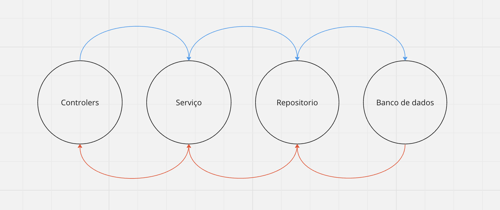

# CRUD JavaScript

O projeto tem como ideia principal um CRUD basico sem conexão com o banco de dados.

Foi projeto seguindo os padrão MVC (Model-View-Controller).



Onde temos as camdas de:

## Controllers (Controladores)

Os controladores são responsáveis por receber as requisições do cliente (geralmente através de uma interface de usuário, como uma página da web ou um aplicativo móvel), interpretá-las e coordenar o fluxo de dados entre as outras camadas da aplicação. Eles não devem conter lógica de negócios significativa, mas sim direcionar as solicitações para os serviços apropriados e, em seguida, retornar as respostas adequadas para o cliente. Em resumo, os controladores são o ponto de entrada da aplicação e controlam o fluxo geral da interação com o usuário.

## Repositories (Repositórios)

Os repositórios são responsáveis pela comunicação com a fonte de dados da aplicação, como um banco de dados ou serviços externos. Eles abstraem os detalhes de armazenamento e recuperação de dados, fornecendo métodos consistentes para acessar e manipular esses dados. Os repositórios encapsulam as consultas e operações de banco de dados, proporcionando uma camada de abstração que facilita a substituição ou mudança do sistema de armazenamento de dados sem afetar o restante da aplicação. Em resumo, os repositórios são responsáveis pela persistência e recuperação de dados.

## Services (Serviços)

Os serviços contêm a lógica de negócios da aplicação. Eles encapsulam operações e funcionalidades que não pertencem diretamente a uma entidade específica, mas sim a um conjunto de operações relacionadas. Os serviços geralmente coordenam várias operações de repositório e executam a lógica de negócios complexa. Eles são responsáveis por aplicar as regras de negócios, realizar validações e executar operações que não se encaixam diretamente em uma única entidade ou objeto. Em resumo, os serviços representam as operações e a lógica de negócios da aplicação.

## Data Base (Banco de dados)

A camada de banco de dados é responsável pelo armazenamento e recuperação de dados de forma organizada e eficiente.No caso de nossa aplicação ela simboliza apenas um objeto de usuários para que possamos fazer a manipulação dos dados de maneira simplificada.

## Bibliotecas utilizadas

### Express

Express é um framework web minimalista e flexível para Node.js, projetado para construir aplicações web e APIs de forma simples e eficiente. Ele fornece um conjunto robusto de recursos para lidar com rotas, requisições HTTP, views, middlewares, entre outros. Com o Express, é fácil criar servidores web e definir rotas para manipular diferentes tipos de requisições HTTP, como GET, POST, PUT e DELETE. Ele é amplamente utilizado na comunidade Node.js devido à sua simplicidade e extensibilidade.

### Body-Parser

Body-Parser é uma biblioteca Node.js usada para analisar o corpo das requisições HTTP, especialmente útil para extrair dados enviados através de formulários HTML ou de requisições AJAX em formato JSON. Ele fornece middleware para o Express e outros frameworks Node.js, permitindo que você obtenha acesso aos dados enviados pelo cliente nos corpos das requisições. Com o Body-Parser, é fácil extrair e manipular os dados enviados em formato JSON, formulários URL-encoded ou em formato multipart/form-data, facilitando o desenvolvimento de APIs RESTful e outras aplicações web em Node.js.

## Testes

1 - Baixar as dependências
```
npm install
```

2 - Executar o projeto

No terminal execute o seguinte comando:
```
npm run start
```

3 - Requests

Foi disponibilizado uma collection do postman na pasta `postman` basta exporta-la em seu aplicativo local e realizar as requests da collection enquanto a aplicação esta executando.
